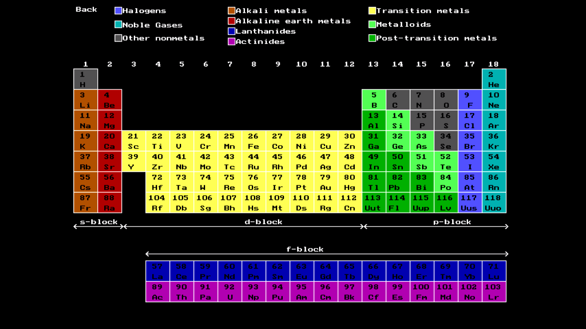
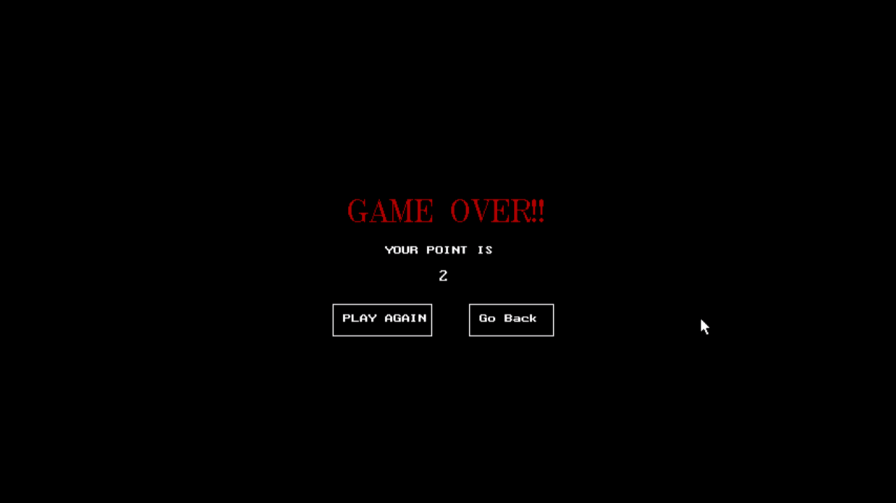

# Periodic-table-with-quiz
Based on C/C++
The index page is titled 003.cpp since it was a 3rd sem project, IK its bad right
Although the project isnt that big it still is quiet good with interactive UI design
Plus theres an animated representation of how electrons rotate around the nucleus whenever you click the element

